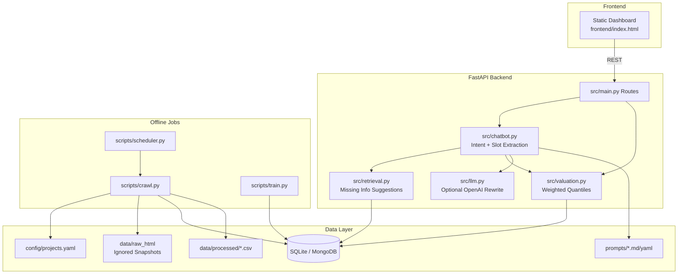
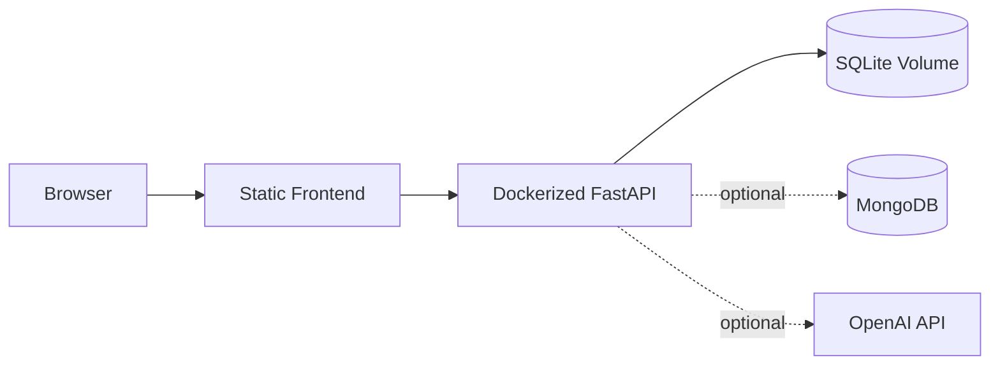

# Architecture Document

## System Overview

HomeValue AI is a FastAPI valuation service with a static dashboard frontend. The backend combines configured public data sources, a crawler/parser pipeline, SQLite or MongoDB storage, comparable-listing valuation, and an optional OpenAI response rewriter for more natural Vietnamese chatbot answers.

## Architecture Diagram

## Components

### Frontend

- Static HTML/CSS/JavaScript dashboard in `frontend/`.
- Calls `/projects`, `/valuation`, `/chat`, and `/market-trends`.
- Stores chat history locally in the browser.

### Backend API

- `src/main.py` owns FastAPI app setup, CORS, startup storage initialization, and routes.
- Pydantic request/response schemas live in `src/schemas.py`.
- `scripts/serve.py` loads `.env` and runs `uvicorn src.main:app`.

### Chatbot Layer

- `src/chatbot.py` detects greeting/help/trend/snapshot/valuation intents.
- Entity extraction handles project, area, bedrooms, purpose, property type, view and furniture.
- Missing fields are enriched by `src/retrieval.py` using nearest project/area hints from stored market data.
- `src/llm.py` optionally rewrites deterministic answers through OpenAI when `VALUATION_LLM_ENABLED=1`.

### Valuation Layer

- `src/valuation.py` loads comparable listings and verified transactions.
- Estimates P10/P50/P90 total price or monthly rent with weighted quantiles.
- Returns sample size, confidence, caveats, top factors, comparable listings and published price snapshots.

### Data Pipeline

- `scripts/crawl.py` reads source definitions from `config/projects.yaml`.
- `src/crawler.py` fetches pages, persists raw snapshots, calls parsers and exports normalized CSVs.
- `src/parser.py` parses markdown/HTML, including public `__NEXT_DATA__` and JSON-LD patterns.
- Storage is abstracted in `src/storage.py`, with SQLite local fallback and MongoDB option.

## Data Flow

1. User sends a request from the dashboard or API client.
2. FastAPI validates input with Pydantic schemas.
3. Chatbot routes natural-language requests to valuation, trend, snapshot or simple response flows.
4. Valuation pulls current market rows from SQLite/MongoDB.
5. The response includes numeric estimate, transparent comparable rows and caveats.
6. Optional OpenAI rewrite turns the computed context into a concise Vietnamese answer.

## Deployment

## Security

- Secrets are loaded from `.env`; `.env` is ignored by git.
- API keys are never exposed to frontend JavaScript.
- CORS origins are configured by `VALUATION_CORS_ORIGINS`.
- SQLite is local by default; production can switch to MongoDB with `MONGODB_URI`.
- The crawler stores public snapshots and does not bypass CAPTCHA or protected APIs.

## Design Decisions

| Decision | Choice | Reason |
|----------|--------|--------|
| Backend | FastAPI | Simple typed API and Swagger docs |
| Storage | SQLite fallback + MongoDB option | Local demo works immediately, production can use managed DB |
| Valuation | Comparable weighted quantiles | Transparent and explainable for MVP data quality |
| Chatbot | Deterministic pipeline + optional LLM rewrite | Keeps numbers grounded while allowing natural phrasing |
| Frontend | Static dashboard | Easy local/demo hosting without build tooling |
| Data config | `config/projects.yaml` | Avoids hard-coding source URLs and thresholds in logic |
