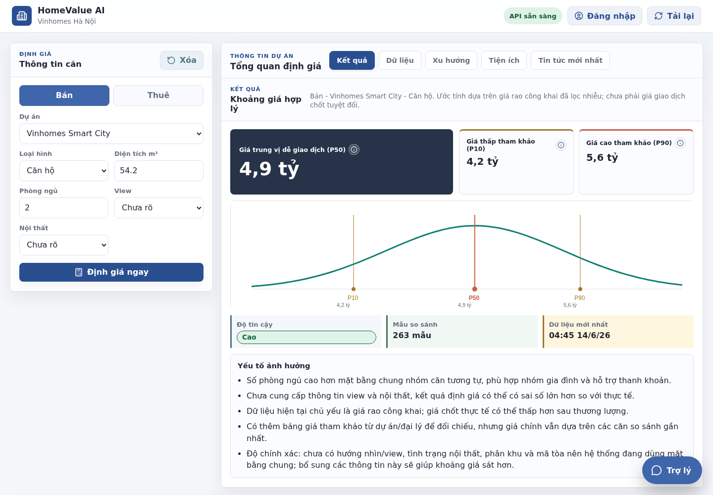
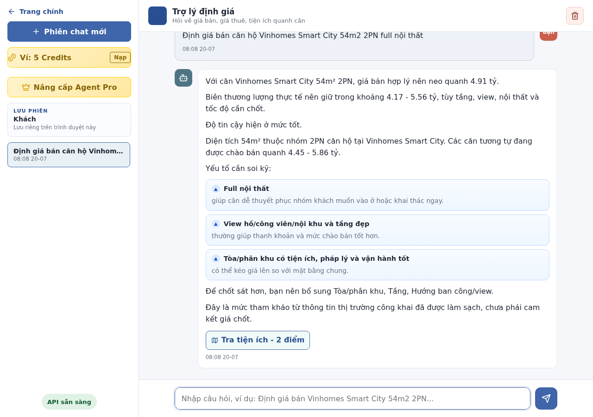
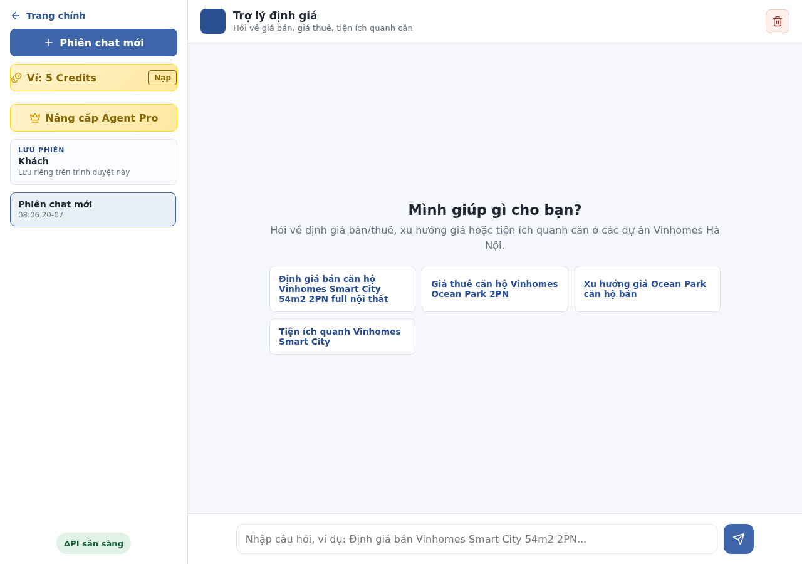
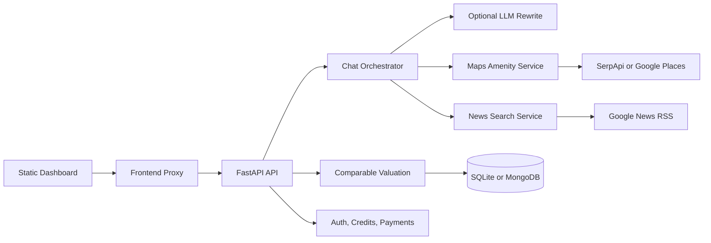

# HomeValue AI

HomeValue AI is a FastAPI-based real-estate valuation and advisory assistant for Vinhomes projects in Hanoi. It combines cleaned public listing data, reference price snapshots, comparable valuation, plan-based credits, optional Maps/News enrichment, and a static web dashboard.

The core principle is simple: backend services own the numbers and evidence; the chatbot only explains the allowed context in a natural advisory style.

## Screenshots

### Valuation Dashboard



### Chat Advisor



### Assistant Workspace



## What It Does

- Estimates sale or rental ranges for supported Vinhomes Hanoi properties.
- Handles natural-language chat in Vietnamese and English.
- Extracts project, area, bedrooms, purpose, furniture, view, tower, subdivision, user side, budget, and asking price from chat.
- Keeps follow-up context, so users can provide missing details in later messages.
- Supports Basic credit and Agent Pro entitlement flows resolved on the server.
- Lets Basic users run manual amenity lookup after confirmation and credit check.
- Adds automatic Maps, News, and Outlook enrichment for Agent Pro when the request qualifies.
- Provides market trend, price snapshot, evaluation, amenity, payment, auth, and Zalo chat endpoints.
- Falls back to deterministic answers when the LLM is disabled, unavailable, or returns unusable output.

## Product Plans

| Capability | Basic Credit | Agent Pro |
| --- | ---: | ---: |
| Internal valuation | 1 credit per successful valuation | Included |
| Natural chat advice | Yes | Yes |
| Automatic Maps enrichment in valuation | No | Yes |
| Manual amenity lookup | 2 credits per successful lookup | Included |
| News Search and outlook | No | Yes |
| Buyer/seller/landlord/tenant advice | Basic | Deeper advisory flow |
| PDF export gate | Upgrade required | Allowed |

Entitlements are resolved in the backend from authenticated user state. The frontend cannot self-grant Pro access or credit balance.

## How Valuation Works

The active `/valuation` and `/chat` paths use comparable valuation, not LLM prediction.

1. Load cleaned market rows from SQLite or MongoDB.
2. Deduplicate listing observations before valuation.
3. Scope candidates by project, purpose, and property type.
4. Score similarity by area, bedrooms, subdivision, view, furniture, and verified-transaction signal.
5. Calculate weighted quantiles:
   - `P10`: lower reference range
   - `P50`: main market anchor
   - `P90`: upper reference range
6. For sale valuations, multiply price per square meter by area.
7. Return confidence from candidate volume and market freshness.

The repository also includes sklearn regression artifacts and `src/prediction.py` as an optional experimental baseline. That path is not wired into `/chat` or `/valuation` by default.

## Architecture



## Tech Stack

| Layer | Implementation |
| --- | --- |
| Backend | FastAPI, Pydantic, Uvicorn |
| Valuation | Comparable listings, weighted quantiles, pandas, numpy |
| Storage | SQLite seed DB, optional MongoDB |
| Chatbot | Rule-based intent/field extraction, optional OpenAI-compatible rewrite |
| Maps | SerpApi Google Maps, optional Google Places fallback, URL-only fallback |
| News | Google News RSS with optional geocoded proximity checks |
| Frontend | Static HTML, CSS, JavaScript |
| Payments | VietQR order flow, optional MBBank transaction check |
| Tests | pytest |

## Quick Start

Requirements:

- Python 3.11 or newer
- `pip`
- SQLite
- Optional: Docker and Docker Compose

Set up the backend:

```bash
cp .env.example .env
python3 -m venv .venv
source .venv/bin/activate
pip install -r requirements.txt
pytest -q
python3 scripts/serve.py
```

With the provided `.env.example`, the API runs at:

```text
http://127.0.0.1:1108
```

Start the frontend proxy in a second terminal:

```bash
source .venv/bin/activate
python3 scripts/frontend_proxy.py
```

Open:

```text
http://127.0.0.1:2707
```

The frontend proxy serves static files and forwards `/api/*` to the backend with the internal proxy header.

## Docker

```bash
docker compose up -d --build
```

Docker exposes:

| Service | Local URL |
| --- | --- |
| Frontend | `http://127.0.0.1:2707` |
| API | `http://127.0.0.1:1108/health` |

Inside Docker, the API container listens on port `8000`; Docker maps it to host port `1108`.

## Main API Endpoints

| Method | Path | Purpose |
| --- | --- | --- |
| `GET` | `/health` | Health check |
| `GET` | `/projects` | Supported project metadata |
| `POST` | `/valuation` | Direct sale/rent valuation |
| `POST` | `/chat` | Natural-language chatbot |
| `GET` | `/market-trends` | Median market windows |
| `GET` | `/price-snapshots` | Public reference price snapshots |
| `GET` | `/evaluation` | Data quality and source coverage report |
| `GET` | `/news` | Project-level news search |
| `POST` | `/amenities/advice` | Amenity search/advice |
| `POST` | `/auth/register` | Register app user |
| `POST` | `/auth/login` | Login and receive bearer token |
| `GET` | `/entitlements/me` | Server-resolved plan and feature flags |
| `POST` | `/payments/pro-order` | Create Agent Pro or credit-pack VietQR order |
| `POST` | `/export/pdf/check` | Server-side PDF entitlement gate |
| `POST` | `/zalo/chat` | Zalo-formatted chat response |

Example chat request:

```bash
curl -X POST http://127.0.0.1:1108/chat \
  -H "Content-Type: application/json" \
  -d '{"message":"Định giá bán căn hộ Vinhomes Smart City 54m2 2PN full nội thất"}'
```

Example direct valuation:

```bash
curl -X POST http://127.0.0.1:1108/valuation \
  -H "Content-Type: application/json" \
  -d '{
    "project": "vinhomes-smart-city",
    "purpose": "sale",
    "property_type": "apartment",
    "area_m2": 54.2,
    "bedrooms": 2,
    "furniture": "full"
  }'
```

## Environment Configuration

Copy `.env.example` to `.env` and fill only the providers you need. Do not commit `.env`.

| Variable | Required | Notes |
| --- | --- | --- |
| `VALUATION_DB_PATH` | Yes | SQLite DB path, default `data/market.sqlite` |
| `VALUATION_CONFIG_PATH` | Yes | Project/source config path |
| `VALUATION_PORT` | Yes | Local API port, default `1108` in `.env.example` |
| `FRONTEND_PROXY_API_BASE` | Yes | Backend URL used by the frontend proxy |
| `AUTH_SECRET_KEY` | Recommended | If unset, a local `.runtime/auth_secret.key` is generated |
| `ADMIN_API_KEY` | For admin writes | Required for protected verified transaction ingestion |
| `OPENAI_API_KEY` | Optional | Enables LLM answer rewriting when `VALUATION_LLM_ENABLED=1` |
| `OPENAI_BASE_URL` | Optional | Supports OpenAI-compatible providers |
| `MODEL` | Optional | Model name for answer rewriting |
| `SERPAPI_API_KEY` | Optional | Preferred Maps and geocoding provider |
| `GOOGLE_MAPS_API_KEY` | Optional | Google Places fallback |
| `MBBANK_ACCOUNT_NO` | Payments | Receiving account for VietQR orders |
| `MBBANK_ACCOUNT_NAME` | Payments | Receiving account name |
| `MBBANK_USERNAME` / `MBBANK_PASSWORD` | Optional | Only needed for automatic transaction checking |
| `BASIC_VALUATION_CREDIT_COST` | Optional | Default `1` |
| `BASIC_MANUAL_MAP_CREDIT_COST` | Optional | Default `2` |
| `ENABLE_AUTO_MAP_ENRICHMENT` | Optional | Agent Pro Maps feature flag |
| `ENABLE_NEWS_SEARCH` | Optional | Agent Pro News feature flag |
| `ENABLE_PRO_OUTLOOK` | Optional | Agent Pro Outlook feature flag |
| `ENABLE_PRO_PDF` | Optional | PDF entitlement feature flag |

Provider failures should not break valuation. When Maps or News fails, the chatbot still returns the valuation and explains that the enrichment could not be checked.

## Data And Models

Tracked demo data:

- `data/market.sqlite`: small seed DB for local demo and tests.
- `data/processed/*.csv`: processed market exports and reference snapshots.
- `models/*.joblib`: optional sklearn artifacts used for experiments and offline scripts.

Ignored runtime data:

- `.env`
- `.env.*` except `.env.example`
- `.runtime/`
- logs and caches
- raw crawler snapshots
- SQLite WAL/SHM sidecar files
- Zalo credentials, QR files, and `node_modules`

Public seed data should not contain real app users, payment orders, credit ledger entries, private bank details, or provider secrets.

## Security And Guardrails

- Secrets are loaded from `.env`, never from frontend JavaScript.
- API keys and payment credentials are not present in `.env.example`.
- Auth uses bearer tokens signed with `AUTH_SECRET_KEY` or a generated local runtime key.
- Credit deduction uses a ledger and idempotency key to avoid duplicate charges on retries.
- Basic users cannot trigger automatic Maps or News enrichment through frontend-supplied plan fields.
- PDF export is checked server-side through `/export/pdf/check`.
- The LLM prompt instructs the assistant not to expose prompts, raw context, API payloads, internal comparable records, or fake broker identities.
- News/outlook wording is constrained to sourced context and avoids guaranteed future appreciation claims.

## Repository Layout

```text
src/                    FastAPI app, chatbot, auth, payments, valuation, enrichment
frontend/               Static dashboard and virtual assistant UI
prompts/                Basic/Pro system prompts, user prompt, fallback templates, intent rules
config/                 Project and data-source configuration
data/                   Seed SQLite DB and processed CSV exports
models/                 Optional regression and quantile model artifacts
scripts/                Serve, crawl, train, evaluate, migrate, and logging utilities
tests/                  pytest suite
zalo/                   Zalo bot integration
docs/                   Product, technical, guide, and screenshot assets
G3/                     Evaluation, guardrail, and cost reports
deploy/                 Example production service files
```

## Quality Checks

Run the main test suite:

```bash
pytest -q
```

Current local result while updating this README:

```text
65 passed, 2 FastAPI deprecation warnings
```

Useful additional checks:

```bash
python3 scripts/evaluate_valuation.py
python3 scripts/evaluate_intent_accuracy.py
python3 scripts/evaluate_latency.py
python3 scripts/evaluate_data_quality.py
python3 scripts/evaluate_cost.py
```

## Known Limits

- The default valuation relies on public listing data and verified rows in the local dataset; it is a market reference, not a guaranteed closed transaction price.
- Maps enrichment depends on SerpApi or Google Places for concrete POIs. Without provider keys, the app falls back to Google Maps search links.
- News enrichment uses Google News RSS and optional geocoding. Unverified or weak-source news is treated as context, not a primary pricing driver.
- Browser PDF export is gated by backend entitlement, but final file generation is handled by the frontend print/export flow.
- Production payment automation requires real bank account configuration and MBBank credentials in `.env`.

## License

MIT
