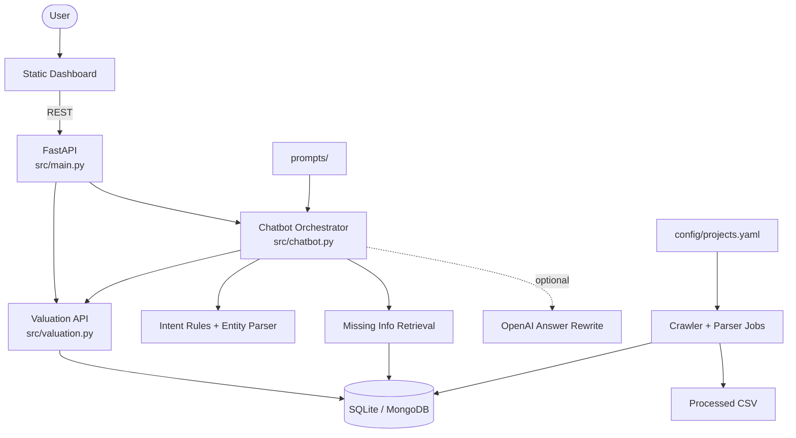
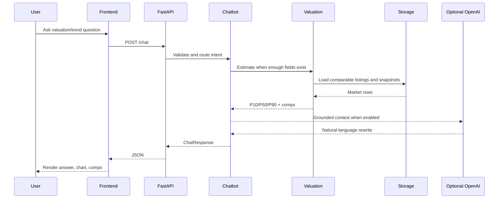

# Architecture Diagram

## Runtime Request Flow

## Component Summary

| Component | Path | Purpose |
|-----------|------|---------|
| API | `src/main.py` | FastAPI app, CORS, routes |
| Chatbot | `src/chatbot.py` | Intent detection, slot extraction, response orchestration |
| Valuation | `src/valuation.py` | Comparable filtering and weighted quantile estimates |
| Storage | `src/storage.py` | SQLite/MongoDB abstraction |
| Crawler | `src/crawler.py`, `scripts/crawl.py` | Fetch and normalize public market data |
| Parser | `src/parser.py` | Extract listings, price snapshots and candidates |
| Frontend | `frontend/` | Browser dashboard for demo workflows |
