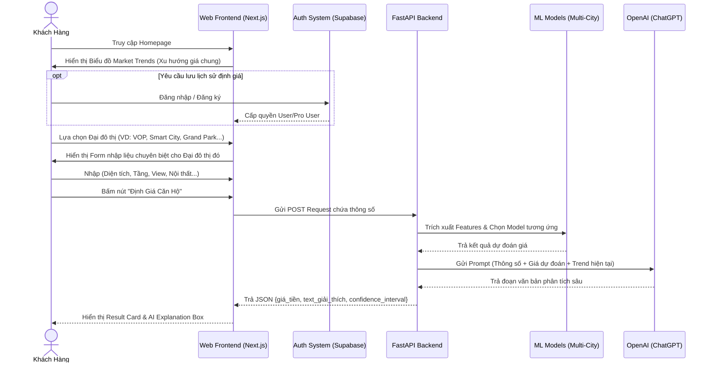

# Wireframe & UI Flow (Full Project)

**Dự án:** AI Định Giá Căn Hộ Đại Đô Thị (HomeValue AI)
**Tầm nhìn:** Nền tảng PropTech toàn diện dành cho mọi Đại đô thị tại Việt Nam.

---

## 1. Sơ Đồ Luồng Người Dùng (Full User Flow)
Sơ đồ dưới đây mô tả luồng thao tác hoàn chỉnh của người dùng trong hệ thống thực tế (bao gồm cả các tính năng đăng nhập, theo dõi lịch sử và phân tích thị trường).



## 2. Bản Vẽ Cấu Trúc Giao Diện (Wireframes)

Dưới đây là bản vẽ khung cấu trúc (Wireframe) chi tiết mô tả cách bố trí các thành phần (Layout) trên 3 màn hình cốt lõi của ứng dụng.

### 2.1. Màn Hình Trang Chủ (Homepage & Market Trends)
Màn hình đầu tiên thu hút người dùng, giúp họ có cái nhìn tổng quan về thị trường trước khi đi sâu vào định giá chi tiết.

```text
+-----------------------------------------------------------------------------+
| [Logo HomeValue AI]         [Định Giá] [Market Trends]    [ Đăng Nhập ] |
+-----------------------------------------------------------------------------+
|                                                                             |
|                           KHÁM PHÁ GIÁ TRỊ THỰC                             |
|                        CĂN HỘ CỦA BẠN TRONG TÍCH TẮC                        |
|                                                                             |
|      [ Dropdown: Chọn Đại Đô Thị (Vinhomes Ocean Park, Smart City...) ]     |
|      [ NÚT: BẮT ĐẦU ĐỊNH GIÁ NGAY ➔ ]                                       |
|                                                                             |
+-----------------------------------------------------------------------------+
| TỔNG QUAN THỊ TRƯỜNG (MARKET TRENDS)                                        |
|                                                                             |
|  [ Biểu Đồ Line Chart: Xu hướng giá m2 trong 6 tháng qua ]                  |
|  | Phân khu Sapphire: Tăng 2%                                               |
|  | Phân khu Zenpark: Đi ngang                                               |
|                                                                             |
|  +-----------------------+  +-----------------------+                       |
|  | Top Căn Đang Giao Dịch|  | Phân Khu Hot Nhất     |                       |
|  | - S2.02: 40 giao dịch |  | 1. Zenpark            |                       |
|  | - R1.01: 25 giao dịch |  | 2. Pavilion           |                       |
|  +-----------------------+  +-----------------------+                       |
+-----------------------------------------------------------------------------+
| Footer: Bản quyền, Chính sách bảo mật, Liên hệ                              |
+-----------------------------------------------------------------------------+
```

### 2.2. Màn Hình Định Giá Cốt Lõi (Valuation Dashboard)
Đây là trái tim của hệ thống (như trong ảnh UI Mockup), chia làm 2 cột rõ rệt để người dùng vừa thao tác vừa xem kết quả trực quan.

```text
+-----------------------------------------------------------------------------+
| [Logo HomeValue AI]    < Trở về trang chủ                   [ Avatar User ] |
+-----------------------------------------------------------------------------+
| KHU VỰC NHẬP LIỆU (Trái)                | KHU VỰC KẾT QUẢ (Phải)            |
|                                         |                                   |
| Phân khu:                               | +-------------------------------+ |
| [ Dropdown: Sapphire, Zenpark...  ▼ ]   | | GIÁ TRỊ ƯỚC TÍNH              | |
|                                         | |                               | |
| Diện tích (m2):                         | |          2.5 TỶ VNĐ           | |
| [ Text Input: Ví dụ 54            ]     | |                               | |
|                                         | | [ Đồ Thị Hình Chuông - Bell ] | |
| Số tầng:                                | | [ Khoảng giá: 2.4 - 2.6 Tỷ]   | |
| [ Dropdown: Thấp, Trung, Cao      ▼ ]   | | Độ chính xác mô hình: 95%     | |
|                                         | +-------------------------------+ |
| Tầm View:                               |                                   |
| [ Dropdown: Hồ Ngọc Trai, VinUni..▼ ]   | +-------------------------------+ |
|                                         | | [Icon Robot] PHÂN TÍCH TỪ AI  | |
| Tình trạng nội thất:                    | | "Căn hộ này có mức giá khá cao| |
| [ Dropdown: Trống, Cơ bản, Full   ▼ ]   | | do nằm ở phân khu Zenpark cao | |
|                                         | | cấp và sở hữu view hồ..."     | |
|    [ NÚT: TÍNH TOÁN GIÁ TRỊ ➔ ]         | +-------------------------------+ |
|                                         |                                   |
|                                         | [ NÚT: LƯU VÀO TÀI KHOẢN ]        |
+-----------------------------------------------------------------------------+
```

### 2.3. Màn Hình Quản Lý Tài Sản (User Dashboard)
Dành cho người dùng (hoặc môi giới) đã đăng nhập để theo dõi lịch sử định giá của mình.

```text
+-----------------------------------------------------------------------------+
| [Logo HomeValue AI]                                         [ Avatar User ] |
+-----------------------------------------------------------------------------+
| MENU TRÁI          | DANH SÁCH BẤT ĐỘNG SẢN ĐANG THEO DÕI                   |
|                    |                                                        |
| - Tổng quan        | +---------------------------------------------------+  |
| - DS Định Giá      | | Căn 2PN - Phân khu Zenpark - View Hồ              |  |
| - Cảnh Báo Giá     | | Định giá hiện tại: 2.5 Tỷ                         |  |
| - Đăng xuất        | | Thay đổi: [Icon Mũi tên xanh] Tăng 2% so với T5   |  |
|                    | | [ Nút: Xem lại phân tích ]  [ Nút: Xóa ]          |  |
|                    | +---------------------------------------------------+  |
|                    |                                                        |
|                    | +---------------------------------------------------+  |
|                    | | Căn Studio - Phân khu Sapphire - View Nội khu     |  |
|                    | | Định giá hiện tại: 1.2 Tỷ                         |  |
|                    | | Thay đổi: [Icon Mũi tên xám] Đi ngang             |  |
|                    | | [ Nút: Xem lại phân tích ]  [ Nút: Xóa ]          |  |
|                    | +---------------------------------------------------+  |
+-----------------------------------------------------------------------------+
```

## 3. Bản Vẽ Trực Quan Minh Hoạ (UI Mockup)
Từ bản vẽ Wireframe khung ở phần 2.2, nhóm đã triển khai lên thiết kế UI Mockup hoàn thiện cho màn hình Valuation Dashboard để chứng minh tính khả thi về mặt thẩm mỹ.


